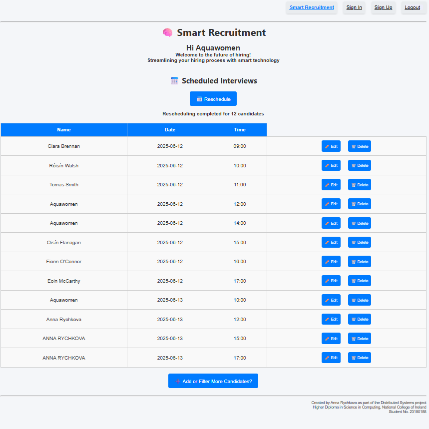
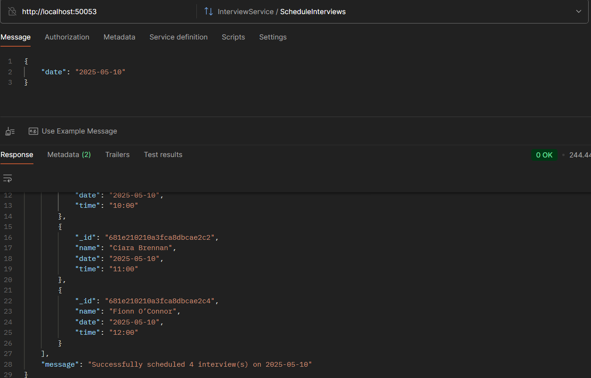

# 🧠 Smart Recruitment System (Node.js + Express + gRPC + EJS)

Welcome to the Smart Recruitment System — a distributed application for managing the full recruitment pipeline: candidate registration, AI-filtering, scheduling interviews, and user authentication. It leverages **Node.js**, **gRPC**, **Express**, and **MongoDB**, with a **dynamic EJS frontend**.

---

## 🚀 Technologies Used

| Tech Stack                                                                                               | Description                 |
| -------------------------------------------------------------------------------------------------------- | --------------------------- |
|         | Backend Runtime             |
|        | Server Framework            |
|                    | Microservices Communication |
|           | NoSQL Database              |
|                       | Dynamic Frontend Templates  |
|         | UI Markup & Styling         |
|  | Client-side Logic           |

---

## 🧩 Services Architecture

This app follows a **modular microservice structure** with gRPC communication and HTTP endpoints.

### 🔐 Auth Service (`/services/auth`)

Handles user registration and login.

- `POST /api/signup` – Create user
- `POST /api/signin` – Log in user

> Logout functionality is implemented only on the client side

---

### 👤 Hiring Service (`/services/hiring`)

CRUD operations for candidates, including CV upload.

- `POST /add-candidate` – Add candidate
- `GET /get-candidates` – Get all candidates
- `PUT /update-candidate/:id` – Edit candidate
- `DELETE /delete-candidate/:id` – Remove candidate

> Accepts `multipart/form-data` for file uploads.

---

### 🧹 Filtering Service (`/services/filtering`)

Filter and clean candidate lists.

- `GET /filter-candidates` – Applies filters (by experience, position) on the server and returns a list of candidates matching the criteria. Additionally, it parses and analyzes each candidate's CV using AI (triggered server-side). Candidate data is fetched directly from the database.
- `DELETE /delete-filtered/:id` – Remove candidate from filtered list

> Extracts and evaluates CV content using `pdf-parse` for resume analysis.

---

### 📅 Interview Service (`/services/interview`)

Schedule, edit, and remove interviews.

- `POST /schedule-interviews` – Schedule interviews for the selected date with filtered candidates (candidate data is fetched directly from the server-side database) and retrieve the full interview schedule.
- `PUT /update-interview/:id` – Reschedule
- `DELETE /delete-interview/:id` – Cancel interview

---

## 🌐 Client Side (`/gui/views`)

Built with **EJS templates** and vanilla JS for interactivity:

- `index.ejs`: Main dashboard
- `signup.ejs`: Registration page
- `signin.ejs`: Login page

Client uses **`/js/*.js`** scripts for AJAX communication with the services.

---

## 📂 Project Structure

```bash
├── controllers         # Express route handlers
├── discovery           # gRPC service discovery
├── gui
│   ├── views           # EJS templates
│   └── app.js          # Express GUI app
├── middleware          # Authentication and utils
├── models              # Mongoose schemas
├── proto               # gRPC proto definitions
├── public              # Static frontend files (CSS, JS, images)
├── routes              # Route definitions
├── services            # Microservices (auth, hiring, filtering, interview)
├── uploads             # Uploaded CVs
├── utils               # Helper functions
├── .env                # Environment variables
├── package.json
```

---

## 📸 UI Preview

| Hiring                                    | Filtering                                        | Interview                                          |
| ----------------------------------------- | ------------------------------------------------ | -------------------------------------------------- |
|  |  |  |

### To explore more details, open the folder 📂 `./screenshots/Interface`

## ⚙️ Getting Started

### 🧱 Project Structure & Modules

This project uses **native ES Modules**, enabled via the following in `package.json`:

```json
{
  "type": "module"
}
```

Use `import`/`export` syntax (instead of CommonJS `require`). Make sure you're running **Node.js v14+** for full support.

---

### ⚙️ Run the Application

To run all services in parallel with minimal terminal noise (ideal for demo or production), use:

#### ▶️ Start All Services

```bash
npm install
npm run discovery
npm start
```

This launches the following:

- 🧑 Auth Service — `services/auth/server.js`
- 📋 Hiring Service — `services/hiring/server.js`
- 🧠 Filtering Service — `services/filtering/server.js`
- 📆 Interview Service — `services/interview/server.js`
- 🌐 GUI Client — `gui/app.js`

All services run in parallel using the `concurrently` package.
The Discovery service is run separately to ensure it starts **before** the other services, allowing time for proper service registration and availability.

---

### 🖼️ Demo & Screenshots

#### HiringService


### FilteringService


### InterviewService





---

### 3. Open in browser

Visit [http://localhost:3000](http://localhost:3000) in your browser.

---

## 🧪 Key Features

- 🔒 User Authentication (Signup, Login, JWT)
- 📥 Add/Edit/Delete Candidates with CV upload
- 🔍 Filter candidates by experience and position
- 📅 Schedule and manage interview dates
- 📂 Fully modular architecture using gRPC

---

## 📜 License

This project is developed as part of the **Distributed Systems** coursework by
Anna Rychkova | NCI | Student No. 23180188

---
